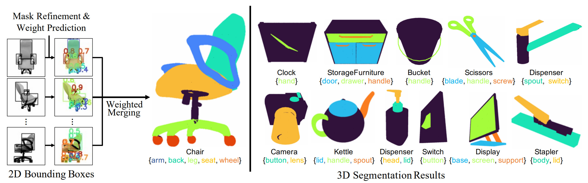

# PartSTAD: 2D-to-3D Part Segmentation Task Adaptation, ECCV 2024


[Hyunjin Kim](https://kormachine.github.io/), [Minhyuk Sung](https://mhsung.github.io/)

[**Project**](https://partstad.github.io), [**arXiv**](https://arxiv.org/abs/2401.05906)


# Updates
- (2024.11.07) Released checkpoints for all 45 categories.
- (2024.09.19) Released the code for PartSTAD including training and evaluation code.

# Introduction
Official implementation of **PartSTAD: 2D-to-3D Part Segmentation Task Adaptation** (ECCV 2024).
### Abstract
We introduce **PartSTAD**, a method designed for the task adaptation of 2D-to-3D segmentation lifting. Recent studies have highlighted the advantages of utilizing 2D segmentation models to achieve high-quality 3D segmentation through few-shot adaptation. However, previous approaches have focused on adapting 2D segmentation models for domain shift to rendered images and synthetic text descriptions, rather than optimizing the model specifically for 3D segmentation. Our proposed task adaptation method finetunes a 2D bounding box prediction model with an objective function for 3D segmentation. We introduce weights for 2D bounding boxes for adaptive merging and learn the weights using a small additional neural network. Additionally, we incorporate SAM, a foreground segmentation model on a bounding box, to improve the boundaries of 2D segments and consequently those of 3D segmentation. Our experiments on the PartNet-Mobility dataset show significant improvements with our task adaptation approach, achieving a **7.0\%p** increase in mIoU and a **5.2\%p** improvement in mAP<sub>50</sub> for semantic and instance segmentation compared to the SotA few-shot 3D segmentation model.

# Installation
This repository is tested with Python 3.10 and Pytorch 2.3.1+cu118.

### Clone Repository & Conda Env Setup
```
git clone https://github.com/KAIST-Visual-AI-Group/PartSTAD
conda create -n partstad python=3.10 
conda activate partstad
```
After creating the Conda environment, you can install the necessary packages using the command below
```
pip install torch==2.3.1 torchvision==0.18.1 torchaudio==2.3.1 --index-url https://download.pytorch.org/whl/cu118
pip install matplotlib einops shapely timm yacs tensorboardX ftfy prettytable pymongo opencv-python transformers scipy open3d
```

### Install GLIP (modified version)
[GLIP](https://github.com/microsoft/GLIP) has been modified to work with the latest version of Pytorch in our repository. Install GLIP using the command below.
```
cd GLIP
python setup.py build develop --user
pip install -U pycocotools
```


### Install Pytorch3D
Pytorch3D is used for rendering 3D point clouds, and it can be installed using the command below.
```
conda install -y -c fvcore -c conda-forge iopath
pip install -U "git+https://github.com/facebookresearch/iopath.git"
pip install "git+https://github.com/facebookresearch/pytorch3d.git@stable"
```

### Install Cut-pursuit Algorithm (Superpoint Generation)
To segment the 3D Point Cloud into superpoints, the cut-pursuit algorithm needs to be installed. It can be installed using the command below.
```
CONDAENV=YOUR_CONDA_ENVIRONMENT_LOCATION
conda install conda-forge::boost
cd partition/cut-pursuit
mkdir build
cd build
cmake .. -DPYTHON_LIBRARY=$CONDAENV/lib/libpython3.10.so -DPYTHON_INCLUDE_DIR=$CONDAENV/include/python3.10 -DBOOST_INCLUDEDIR=$CONDAENV/include -DEIGEN3_INCLUDE_DIR=$CONDAENV/include/eigen3
make
```

# Run Quick-Demo
You can easily run the Part Segmentation demo using the command below. The demo performs inference on preprocessed data located in the `demo_examples/` folder. You can easily prepare the demo data by unzipping `demo_examples.tar.xz`.

```
python run_demo.py
```
> :bulb: **To execute demo, a finetuned GLIP checkpoint corresponding to the class category is required (Chair, Eyeglasses, Kettle, and Stapler). It can be downloaded from [here](https://huggingface.co/datasets/minghua/PartSLIP/tree/main/models). Please download checkpoints to `models/`. Also SAM checkpoint is required, please download it from [here](https://dl.fbaipublicfiles.com/segment_anything/sam_vit_h_4b8939.pth)**

After run `run_demo.py`, you can get the segmentation result in `demo_examples_result/visualization` as an `.gif` format like below.


# 3D Point Cloud Part Segmentation with PartSTAD
To train and evaluate PartSTAD, data preprocessing is required first. If preprocessed data exists, you can skip the **Data Preparation** and **Data Preprocessing** steps and move directly to the **Training** and **Evaluation** steps.

### Data Preparation
You can download the PartNet-Mobility (PartNet-Ensembled) dataset used in the paper from [here](https://huggingface.co/datasets/minghua/PartSLIP/tree/main/).


### Data Preprocessing
Data preprocessing can be performed using the command below. `--category` specifies the class category, `--data_dir` is the directory of the PartNet-Mobility dataset downloaded in the **Data Preparation** step, and `--save_dir` is the directory where the preprocessed data will be saved. 


> :bulb: **To execute data preprocessing, a finetuned GLIP checkpoint corresponding to the class category is required. It can be downloaded from [here](https://huggingface.co/datasets/minghua/PartSLIP/tree/main/models). Please download checkpoints to `models/`. Also SAM checkpoint is required, so please download it from [here](https://dl.fbaipublicfiles.com/segment_anything/sam_vit_h_4b8939.pth)**

```
python preprocess.py \
  --category {category} \
  --data_dir {3d data dir} \
  --save_dir {dir to save preprocessed results}
```


### Training Weight Prediction Network
After data preprocessing is complete, you can proceed with PartSTAD training using the command below. `--test_dir` and `--test_preprocess_dir` are required for validation. The validation data is the same as PartSLIP, and the list can be found in `val_list.json`. The training results are saved in the `--save_dir`.
```
python run_partstad.py \
  --train \
  --category {category} \
  --train_dir {train 3d data dir} \
  --test_dir {test 3d data dir} \
  --train_preprocess_dir {train preprocessed data dir} \
  --test_preprocess_dir {test preprocessed data dir} \
  --save_dir {dir to save training result}
```


### Evaluation
Evaluation can be performed using the following command. For `--ckpt`, specify the path to the model checkpoint to be used for evaluation (mandatory), and for the other directories, use the same ones as in the training.
```
python run_partstad.py \
  --test \
  --ckpt {path to ckpt} \
  --only_model_weight
  --category {category} \
  --test_dir {test 3d data dir} \
  --test_preprocess_dir {test preprocessed data dir} \
  --save_dir {dir to save evaluation result}
```

If you want to evaluate using the checkpoint with the best validation results, simply run the command below. For `--ckpt_dir`, use the same path as `--save_dir` from the training.
```
python eval_script.py \
  --ckpt_dir {ckpt dir} \
  --test_dir {test 3d data dir} \
  --test_preprocess_dir {test preprocessed data dir}
```

# Citation
If you find our work useful, please consider citing:
```
@inproceedings{kim2024partstad,
    title={PartSTAD: 2D-to-3D Part Segmentation Task Adaptation}, 
    author={Kim, Hyunjin and Sung, Minhyuk},
    booktitle={ECCV},
    year={2024}
}
```

```
@article{kim2024partstad,
    title={PartSTAD: 2D-to-3D Part Segmentation Task Adaptation}, 
    author={Hyunjin Kim and Minhyuk Sung},
    journal={arXiv preprint arXiv:2401.05906},
    year={2024}
}
```
